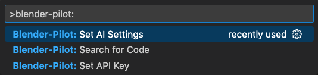
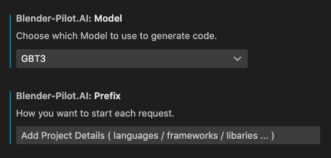

## **Features**

Easily integrate AI auto-generated code into your files.

For the use of Blender Python API, simply enter a prompt to generate your code.

#### Step 1:

- CMD + Shift + P

#### Step 2:

- Search for 'Blender-Pilot'

## **Set Your API Key**

#### Step 3:

- Choose Blender-Pilot: Set API Key

#### Step 4:

- Enter your OpenAI API Key

## SEARCH FOR CODE

#### Step 5:

- Choose Blender-Pilot: Search Code

#### Step 6:

- Enter a Prompt to Generate Code

## Requirements

OpenAI Personal API Key [openai.com/account/api-keys](https://beta.openai.com/api-keys)

## Extension Settings

Edit Model Settings

Set API Key

## Known Issues

## Release Notes

### 0.0.1

Initial release of Blender-Pilot

---

### 0.0.2

#### Added Configuration Settings:

- Store API Key
- Set AI Model
- Customisable Prefix

---
